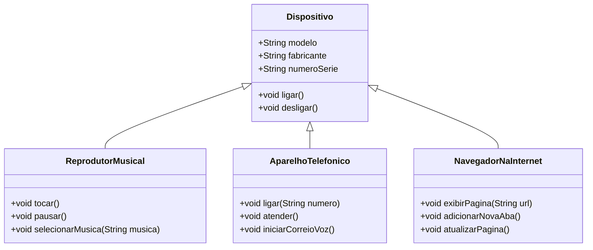

```mermaid
classDiagram
    class Dispositivo {
        +String modelo
        +String fabricante
        +String numeroSerie
        +void ligar()
        +void desligar()
    }

    class ReprodutorMusical {
        +void tocar()
        +void pausar()
        +void selecionarMusica(String musica)
    }

    class AparelhoTelefonico {
        +void ligar(String numero)
        +void atender()
        +void iniciarCorreioVoz()
    }

    class NavegadorNaInternet {
        +void exibirPagina(String url)
        +void adicionarNovaAba()
        +void atualizarPagina()
    }

    Dispositivo <|-- ReprodutorMusical
    Dispositivo <|-- AparelhoTelefonico
    Dispositivo <|-- NavegadorNaInternet

```
